# Design Document

## Problem Framing

Digital reputation monitoring is not just a scraping or dashboarding problem. Source data is noisy,
duplicated, inconsistently formatted, and often low-context. A single brand mention can appear as a
news headline, syndicated article, app review, forum post, or search-result snippet.

The system is designed around four questions:

1. Is this record relevant to the brand or reputation context?
2. If relevant, which reputation driver and sub-driver does it belong to?
3. What sentiment is associated with the mention?
4. Can the classification be audited from the original evidence?

## Design Goals

- Reproducible local execution.
- Stable processed outputs for dashboarding and review.
- Explainable reputation driver and sub-driver classification.
- Row-level auditability.
- Offline-first deterministic behavior.
- Optional LLM enhancement for ambiguous records.
- Configuration-driven taxonomy and source normalization.

## Non-Goals

- Training a supervised model on a small sample.
- Building a full production crawler.
- Treating LLM output as ground truth.
- Making the dashboard responsible for classification.
- Hiding low-confidence or ambiguous decisions.
- Building a real-time streaming system for a daily monitoring use case.

## System Flow

```mermaid
flowchart LR
    A[Raw workbook] --> B[Settings and config]
    B --> C[Schema standardization]
    C --> D[Source normalization]
    D --> E[Deduplication]
    E --> F[Relevance filtering]
    F --> G[Taxonomy classification]
    G --> H[Optional LLM fallback]
    H --> I[Validated output records]
    I --> J[CSV, Excel, Parquet]
    J --> K[Streamlit dashboard]
```

Each stage adds a specific analytical guarantee:

| Stage | Purpose |
| --- | --- |
| Schema standardization | Converts workbook fields into a stable internal schema. |
| Source normalization | Makes source charts and filters usable. |
| Deduplication | Removes repeated mentions before counting. |
| Relevance filtering | Prevents off-topic records from polluting summaries. |
| Taxonomy classification | Maps relevant mentions to the approved driver/sub-driver framework. |
| Output validation | Ensures exported records contain the expected fields and labels. |
| Dashboard serving | Lets analysts explore aggregates and inspect original evidence. |

## Data Contract

The processed output standardizes mention records into these dashboard-ready fields:

| Field | Description |
| --- | --- |
| `source_row_id` | Original row reference from the workbook. |
| `date` | Normalized mention date where available. |
| `url` | Original URL. |
| `source_name` | Standardized source or inferred domain. |
| `title` | Original mention title. |
| `opening_text` | Source-provided opening text. |
| `hit_sentence` | Source-provided matched sentence. |
| `clean_text` | Consolidated text used for classification and theme extraction. |
| `sentiment` | Normalized sentiment label. |
| `reach` | Numeric reach value where available. |
| `is_relevant` | Whether the mention is retained for reputation analysis. |
| `relevance_reason` | Explanation for relevance decision. |
| `reputation_driver` | Top-level reputation category. |
| `sub_driver` | Specific taxonomy sub-driver. |
| `classification_confidence` | Interpretability score for the assigned label. |
| `classification_reason` | Human-readable explanation for the assigned label. |
| `matched_terms` | Keywords or phrases that influenced classification. |
| `classification_source` | Whether classification came from rules or LLM fallback. |
| `dedupe_key` | Stable key used for duplicate detection. |

## Core Decisions

| Decision | Rationale |
| --- | --- |
| Rules first | Stable, cheap, auditable, and testable. |
| Optional LLM fallback | Useful for ambiguous text, but kept away from the default path. |
| Pydantic schemas | Constrain classifications to known labels and fields. |
| Configured taxonomy | Keeps reputation framework changes reviewable outside Python code. |
| Conservative dedupe | Removes obvious duplicates without merging distinct stories too aggressively. |
| Parquet serving file | Keeps dashboard reads small and fast. |
| Dashboard as review layer | Prevents interactive UI code from becoming the classification engine. |

## Classification Strategy

The deterministic classifier scores every sub-driver using terms from
[config/taxonomy.yml](../config/taxonomy.yml):

- Single-token keyword match: 1 point.
- Multi-word phrase match: 2 points.
- Highest scoring sub-driver wins.
- Ties are resolved with a deterministic priority order.
- If no exact taxonomy terms match, contextual fallbacks assign a conservative bucket.

The tie-break order prioritizes higher-risk and more specific signals before broad brand mentions:

1. Regulatory compliance and governance.
2. Customer support and complaint resolution.
3. Digital and omnichannel experience.
4. Social impact and CSR.
5. Product strategy.
6. Product and service quality.
7. Thought leadership.
8. Brand visibility and marketing.

## Optional LLM Fallback

The optional LLM path is a fallback, not the primary authority. When enabled, low-confidence records
can be sent to a Pydantic AI classifier backed by OpenRouter. The model must return a structured
response that passes the classification schema.

Safeguards:

- Disabled by default.
- Used only when explicitly enabled.
- Must return valid taxonomy labels.
- Invalid or failed responses are discarded.
- Deterministic classification remains the fallback.
- Results are cached by normalized text and sentiment hash.
- The processed row records whether classification came from rules or LLM fallback.

## Auditability Model

Aggregate dashboard insights can be traced back to individual records. Each row preserves original
text, URL, standardized source, source row id, relevance reason, driver, sub-driver,
classification reason, matched terms, confidence, classification source, and dedupe key.

That matters because reputation intelligence is often used in high-context business reviews. A chart
alone is not enough; the analyst needs the underlying evidence.

## Validation Strategy

Regression tests target decisions most likely to affect final insights:

- Product launch mentions map to Product Strategy.
- App and transaction complaints map to Digital & Omnichannel Experience.
- SEBI and compliance mentions map to Regulatory Compliance & Ethical Governance.
- Dataset-scoped app reviews without explicit brand names can still be retained.
- Generic off-topic records are removed as irrelevant.
- Sentiment labels are normalized.
- Excel serial dates and native datetimes are parsed correctly.
- URL canonicalization removes obvious duplicates.
- Source aliases and Play Store URLs are standardized.

## Production Path

A production version would extend the local workflow into a monitored daily
reputation-intelligence system:

- Source registries for news, social platforms, app stores, and review sites.
- Raw immutable object storage partitioned by source and ingestion date.
- Scheduled collectors with source-specific state and retry handling.
- Warehouse marts for dashboarding and analyst queries.
- Analyst review queues for low-confidence and high-risk mentions.
- Human override tracking as labeled feedback.
- Data quality checks for source freshness, empty extraction, duplicate spikes, and schema drift.
- LLM observability for cost, latency, validation failure rate, and cache hit rate.
- Access controls, retention policies, and source licensing review.

The current project is the local prototype of that system: small enough to run in a few commands,
but structured so each stage can later be replaced with production storage, orchestration, and
monitoring.
